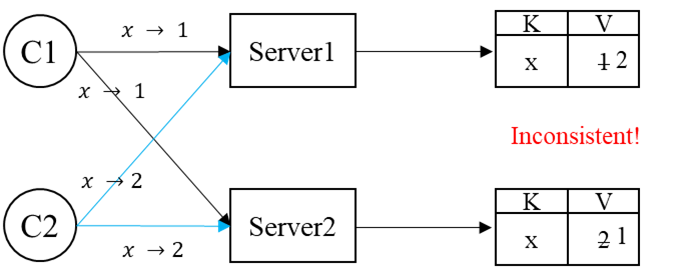

## BIG STORAGE

### Why Hard（构建分布式存储系统的难点）：

1. Performance性能问题
   在分布式存储系统中，通常会将数据进行分片（sharding）分散存储在不同服务器中。
2. Faults故障问题
   服务器数量多所以故障也变得非常常见，需要设计容错机制（fault tolerance）。
3. Fault Tolerance容错问题
   通常容错都是靠复制（replication）实现。
4. Replication备份问题
   数据备份后就可能导致数据不一致（inconsistence）。
5. Consistency一致性问题
   如果要保持一致性，很可能系统的性能（performance）就会降低。

> 这样问题1~5就形成闭环，所以设计分布式存储系统时需要作出一些tradeoff，比如将一致性的要求降低。

### Strong Consistency（强一致性）：

强一致性其实就是让client感觉在和单一server通讯，任何时候都好像只有一份数据。

### Bad Replication Design（一个例子）：

## Google File System

gfs没开源，hdfs是参考gfs论文写的开源文件系统。

### GFS设计时的目标：

1. Big
   能存储巨型文件，一个文件比一个磁盘都大。
2. Fast
   性能要好。
3. Global
   能供多个上层应用同时使用、共享文件数据。
4. Sharding
   每个文件都将自动地被GFS分割到许多chunkserver上。
5. Automatic Recovery
   能够自动从部分故障中恢复。
6. Single Data Center
   GFS并不是把数据分散在世界各地，通常情况下只在一个大型数据中心中运行。
7. Internal Use
   GFS设计时是给Google内部工程师使用的。
8. Big Sequential Access

> PS：GFS并没有保证强一致性，为了更好的性能。
> PS：GFS建议用户程序将数据和checksum一起使用，并且在GFS返回数据时检查一下checksum。

### GFS中master存储的data：

1. file name -> array of chunk handle;
2. chunk handle -> list of chunkservers; version number; primary chunk server; lease expiration;
3. operation log; checkpoint;（disk中）

会被存储到operation log和checkpoint中的数据有：

1. file name -> array of chunk handle
2. chunk handle -> list of chunkservers
3. chunk handle -> version number

### GFS Read流程：

1. client将<filename, offset>发送给master
2. master返回<handle, list of chunkservers>给client，client会缓存此消息一段时间
3. client向某个chunkserver发送读请求
4. chunkserver返回结果给client

> 对于超过64MB的读取，或者读取的范围跨越了chunk边界，application底层链接的GFS的client lib库会将其自动分成多次read请求。

### GFS Write流程：

如果没有primary（只发生在master）：

1. 找到该chunk的所有up to date的replicas
2. 选择一个作为the primary，其余作为 the secondary
3. 增加该chunk的version number（version number只会在这种情况增加）（先写到operation log中？）
4. 告诉涉及到的chunkserver它们是primary（给予chunk lease）或者secondary

primary已经被选出后：

1. primary选择一个offset
2. all replicas（包括primary）在offset处写数据， secondary在写好后会给primary发送ACK消息
3. 如果primary收到所有ACK消息后则给client返回success代表写操作成功；
   如果primary没有收到一部分ACK消息，则给client返回failure，此后client可能会重启write

> 拥有两个primary且不知道彼此的错误的情况称为"脑裂"（split brain）
> GFS通过lease的expiration time来避免一个chunk有两个primary的情况，如果master短时间内和primary联系不上了（心跳包），master也至少会等到lease过期再指定新的master。

### 如果想将GFS升级到强一致性：

1. 增加重复请求检测机制
   拒绝重复数据的append or write请求。
2. secondary必须执行primary请求，不能随意返回error而没有代价
   如果secondary遇到一些不可避免的错误，则将secondary提出集群。
3. 采用两阶段提交（2 phase commit）方式进行primary和secondary操作
   每次primary和secondary真正执行操作前，primary提前询问并确认所有secondary能够执行此次操作。（2PC会带来阻塞，降低性能）
4. 如果primary在确认所有ACK消息前崩溃了，master随后选举出新的primary，则此时primary和其它secondary就可能不一样，此时需要显式同步primary和其它secondary。（老师说或者还可以让secondary也有租约lease解决此问题？）

> GFS的缺点之一：master如果故障需要切换，需要人工干预，且需要几十分钟。

> MIT6.824 Lab2和Lab3会要求实现强一致性，到时候会进一步感受上述几点设计。
