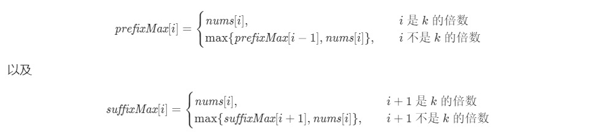
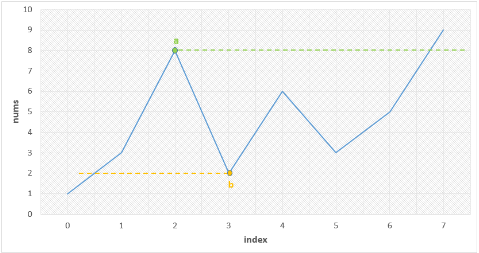

[toc]


## 1.两数之和

题目：给定一个整数数组 nums 和一个整数目标值 target，请你在该数组中找出 和为目标值 的那 两个 整数，并返回它们的数组下标。

你可以假设每种输入只会对应一个答案。但是，数组中同一个元素不能使用两遍。

你可以按任意顺序返回答案。

思路1：暴力搜索

思路2：用哈希表，遍历数组中每个元素x，每次在哈希表中查询target-x是否存在；


## 2.两数相加

题目：给你两个 非空 的链表，表示两个非负的整数。它们每位数字都是按照 逆序 的方式存储的，并且每个节点只能存储 一位 数字。

请你将两个数相加，并以相同形式返回一个表示和的链表。

你可以假设除了数字 0 之外，这两个数都不会以 0 开头。

思路：就是你懂的，一个一个来就行；


## 3.无重复字符的最长子串

题目：给定一个字符串，请你找出其中不含有重复字符的 **最长子串** 的长度。

思路：就是左右指针，先移动右指针，再移动左指针...记录最大长度；


## 4.寻找两个正序数组的中位数

题目：给定两个大小分别为 `m` 和 `n` 的正序（从小到大）数组 `nums1` 和 `nums2`。请你找出并返回这两个正序数组的中位数。

思路1：O(N)，就是类似两个弹夹打子弹；

思路2：O(LogN)，将较短的数组设置为m，较长的数组设置为n，二分法在[0, m]中找切分点，找将两个数组分成两个部分的点。


## 5.最长回文子串

题目：给你一个字符串 `s`，找到 `s` 中最长的回文子串，s = “babad”，输出“bab”；

**思路1**：动态规划，dp[i, j]表示下标i到j是否是回文子串(bool值)，则dp[i, j] = dp[i+1, j-1] && (s[i] == s[j])；在这过程中记录最长的回文子串(用substr)；O(N^2)

**思路2**：中心扩展，先选出预备中心（初始从长度为1和长度为2的中心），然后向两边扩展。O(N^2)

**思路3**：Manuter方法（略）


## 6.正则表达式匹配

题目：给你一个字符串 s 和一个字符规律 p，请你来实现一个支持 '.' 和 '*' 的正则表达式匹配。

- '.' 匹配任意单个字符

- '*' 匹配零个或多个前面的那一个元素

所谓匹配，是要涵盖整个字符串s的，而不是部分字符串。注意".*"相当于是任意个"."因此可以匹配任意字符串。

**思路**：用动态规划。先创建规则match，就是两个小写字母相同或者其中一个是"."就认为是match的。dp[i, j]代表着s中前i个和p中前j个是否匹配。显然dp[0, 0]为true。

- 首先，如果p[j - 1]不是'*'则必须要求s[i-1]和p[j-1]必须match。
- 如果p[j-1]是'*'，
  - 如果s[i-1]和p[j-2]match，则dp[i, j] = dp[i-1, j] 或 dp[i, j-2]，分别代表将匹配上的字符给删除，和一个也不匹配的情况。
  - 如果不match，就dp[i, j] = dp[i, j-2]。


## 7.盛最多水的容器

题目：给你 n 个非负整数 a1，a2，...，an，每个数代表坐标中的一个点 (i, ai) 。在坐标内画 n 条垂直线，垂直线 i 的两个端点分别为 (i, ai) 和 (i, 0) 。找出其中的两条线，使得它们与 x 轴共同构成的容器可以容纳最多的水。

说明：你不能倾斜容器。

**思路**：用两个指针，一开始指向左右两端，每次移动当前数值较小的那个指针，直到两个指针相遇，记录中间过程的最大乘积。


## 8.三数之和

题目：给你一个包含 n 个整数的数组 nums，判断 nums 中是否存在三个元素 a，b，c ，使得 a + b + c = 0 ？请你找出所有和为 0 且不重复的三元组。

注意：答案中不可以包含重复的三元组。

**思路**：先将原始数组sort了，再循环遍历每个元素，将遍历的每个元素x视为三元组的第一个数，因此剩下的任务就是从右边的数组中再选出两个数的和为-x，这就可以用之前“两数之和”中的想法，用两个指针一前一后不断靠近，将其中满足和为-x的二元组再和x组成三元组即可。（注意每次靠近的时候必须要求元素不同，即22223从2变化到3而非重复的2）


## 9.电话号码的字母组合

题目：给定一个仅包含数字 2-9 的字符串，返回所有它能表示的字母组合。答案可以按 任意顺序 返回。

给出数字到字母的映射如下（与电话按键相同）。注意 1 不对应任何字母。（就是九宫格按键的那种手机打字，问按了几个数字的字母组合而已）

**思路**：就是递归函数，每次遍历当前按钮对应的所有字母，将每个字母都加到待选字符串末尾，然后递归调用下一层函数，调用完后，再pop调末尾刚加入的字母，再换当前按钮的下一个字幕再来一遍。


## 10.删除链表倒数第N个

题目：给你一个链表，删除链表的倒数第 `n` 个结点，并且返回链表的头结点。

**思路1**：经典思路就是两个指针，一个指针先走n-1步。

**思路2**：递归函数，函数返回节点指针。每层递归逐步进入链表的后面结点，当递归完后再将一个全局变量加1，这样当全局变量加到n时就代表是倒数第n个结点了，这时再直接返回当前结点的next指针即可。上层函数会把递归函数返回值当作当前结点的next。（如果不是倒数第n个，就返回当前结点指针）。


## 11.有效的括号

**题目**：给定一个只包括 '('，')'，'{'，'}'，'['，']' 的字符串 s ，判断字符串是否有效。

**有效字符串需满足**：左括号必须用相同类型的右括号闭合，左括号必须以正确的顺序闭合。

思路：用栈即可。


## 12.合并两个有序链表

题目：将两个升序链表合并为一个新的升序链表并返回。新链表是通过拼接给定的两个链表的所有节点组成的。 

思路：打子弹；


## 13.括号生成

题目：数字 `n` 代表生成括号的对数，请你设计一个函数，用于能够生成所有可能的并且 有效的括号组合。

```c++
输入：n = 3
输出：["((()))","(()())","(())()","()(())","()()()"]
```

思路：每次只要保证左括号数小于等于右括号数即可。递归。


## 14.合并K个升序链表

题目：给你一个链表数组，每个链表都已经按升序排列。请你将所有链表合并到一个升序链表中，返回合并后的链表。

**思路1**：先弄一个merge2lists函数，每次将两个链表合并；再弄一个递归函数merge，该函数接受left和right两个代表下标的值。先计算出mid下标，再递归调用merge分别将left..mid和mid..right两个数组合并，合并完再调用merge2lists。

**思路2**：用一个实现了operator<的类代表链表中的一个结点，使用priority_queue，一开始将每个链表的头结点放入queue中，接着取出queue中头结点（代表值最小），如果这个结点有next则把next点压入queue中即可。


## 15.下一个排列

题目：实现获取 下一个排列 的函数，算法需要将给定数字序列重新排列成字典序中下一个更大的排列。如果不存在下一个更大的排列，则将数字重新排列成最小的排列（即升序排列）。必须 原地 修改，只允许使用额外常数空间。例如：[1,2,3]的下一个就是[1,3,2]

**思路**：（两遍扫描）

- 从右到左，找到第一个不满足降序排列的位置（4321叫降序），比如4231发现的就是2<3，因此是2所在的位置。

- 知道2后，就再次从右到左找到第一个大于2的元素，因此是3所在的位置。
- 交换2和3的位置，得到4321。
- 再将3左边的数字reverse一下（即使3右边的数字升序排列），得到4312。


## 16.最长有效括号

题目：给你一个只包含 `'('` 和 `')'` 的字符串，找出最长有效（格式正确且连续）括号子串的长度。

```c++
输入：s = ")()())"
输出：4
解释：最长有效括号子串是 "()()"
```

思路：（用栈扫描）

- 建立长为字符串长度的数组，初始全为0。

- 用stack<int>，每遇到一个左括号，就将其下标i压入栈中。
- 如果遇到一个右括号，此时若栈为空，则数组中下标i的元素置为1；如果不为空，就从栈中pop出栈顶元素；
- 扫描完后，将栈中所有剩余元素（下标i）弹出，将这些下标对应的数组元素置为1；
- 至此，问题就变为了找数组中连续0的最大长度即可。


## 17.搜索旋转排序数组

题目：整数数组 nums 按升序排列，数组中的值 互不相同 。在传递给函数之前，nums 在预先未知的某个下标 k（0 <= k < nums.length）上进行了 旋转，使数组变为 [nums[k], nums[k+1], ..., nums[n-1], nums[0], nums[1], ..., nums[k-1]]（下标 从 0 开始 计数）。例如， [0,1,2,4,5,6,7] 在下标 3 处经旋转后可能变为 [4,5,6,7,0,1,2] 。给你 旋转后 的数组 nums 和一个整数 target ，如果 nums 中存在这个目标值 target ，则返回它的索引，否则返回 -1 。

要求：必须时间复杂度为O(LogN)

思路：（依然二分法）

- 二分为两个区间，如果一个区间[x, ..., y]中nums[x] < nums[y]则代表这个区间是有序的，而另一个区间肯定不是有序的。
- 如果要找的值在nums[x]与nums[y]就在有序的一般区间中去二分查找。
- 如果要找的值在另一个区间中，就递归调用本函数，继续二分区间的去找。


## 18.在排序数组中查找元素的第一个和最后一个位置

题目：给定一个按照升序排列的整数数组 nums，和一个目标值 target。找出给定目标值在数组中的开始位置和结束位置。

如果数组中不存在目标值 target，返回 [-1, -1]。

要求：时间复杂度为O(LogN)

思路：就是二分法


## 19.组合总和

题目：给定一个无重复元素的数组 candidates 和一个目标数 target ，找出 candidates 中所有可以使数字和为 target 的组合。

candidates 中的数字可以无限制重复被选取。

说明：所有数字（包括 target）都是正整数。解集不能包含重复的组合。 

思路：（标准的**搜索回溯**）

- 每遇到一个数字都有两种选择，用或者不用（就跳到下一个数字）

- 设置一个dfs(candidates, target, vec, idx)，代表可选的数字下标为[idx, ...]，同时要拼凑出target值，当前的答案记录在数组vec中。

- 每次都可以dfs(candidates, target - candidates[idx], vec U {candidates[idx]}, idx)或dfs(candidates, target, vec, idx + 1)；

  递归下去即可。


## 20.接雨水

题目：给定n个非负整数表示每个宽度为1的柱子的高度图，计算按此排列的柱子，下雨之后能接多少雨水。

**暴力思路**：每一列能存储的最大雨水量就是其两边最大高度值取较小值减去本列的柱子高度。O(N^2)

**思路1**：用两个数组left和right，分别代表从左到右的最大高度值以及从右到左的最大高度值，比如柱子高为[0,1,0,2,1,0]则left是[0,1,1,2,2,2]而right是[2,2,2,2,1,0]

在left和right中取min则是[0,1,1,2,1,0]再减去柱子高后得到[0,0,1,0,0]因此只能存储1雨水；

**思路2**：（用单调栈）

比如是[0,2,1,0,3]则stack = {}，

- 遇到0，压入栈{0}
- 遇到2，发现2>height[stack.top]=0,则pop出0，发现栈空遂停止，将2压入栈{2}
- 遇到1，压入栈{2,1}
- 遇到0，压入栈{2,1,0}
- 遇到3，发现3>0，则pop出0，此时top=1，取min(3,1)=1，可以积水=(min(3,1)-0)*(下标4-下标2-1) = 1
- 继续pop出1，此时top=2，可以积水=(min(3,2)-1)*(下标4-下标1-1)=2
- 继续pop出2，此时栈空停止，因此最后总积水为2+1=3


## 21.全排列

题目：给定一个没有重复数字的序列，返回其所有可能的全排列。

思路：（回溯）

- 递归函数backtrack(... int first, vector<int> nums)

- first代表当前排列到的数字下标；

- 做法就是遍历first及其之后的各个数字，将各个数字与下标first的数字swap之后递归到下一层。递归完后再swap换回来后尝试下一个数字。


## 22.旋转图像

题目：给定一个 n × n 的二维矩阵 matrix 表示一个图像。请你将图像顺时针旋转 90 度。你必须在 原地 旋转图像，这意味着你需要直接修改输入的二维矩阵。请不要 使用另一个矩阵来旋转图像。

思路：纯数学题


## 23.字母异位分组

题目：给定一个字符串数组，将字母异位词组合在一起。字母异位词指字母相同，但排列不同的字符串。如['abc','cba','acc','cca']就分为['abc','cba']与['acc','cca']两组。

大神思路：用不同的质数表示26个字母，这样就可以保证不同组的字母异位词的相乘的积不同。但可能会导致乘积溢出。

正常思路：用map<string, vector<string>>或<string, list<string>>其中的key值必须保证同组字母异位分词的key相同，不同组的不同。比如可以将'abc'和'cba'都映射成'a1b1c1'或者都排序成为'abc'。


## 24.最大子序和

题目：给定一个整数数组 `nums` ，找到一个具有最大和的连续子数组（子数组最少包含一个元素），返回其最大和。

思路：面试腾讯做过。

```c++
for (int num : nums) {
    if (sum > 0)
        sum += num;
    else
        sum = num;
    res = max(res, sum);
}
```


## 25.跳跃游戏

题目：给定一个非负整数数组 `nums` ，你最初位于数组的 **第一个下标** 。数组中的每个元素代表你在该位置可以跳跃的最大长度。判断你是否能够到达最后一个下标。

思路：就是维护一个能跳到的最远举例maxLen，每扫描到一个下标i，maxLen=max(i+nums[i], maxLen)；如果扫描的下标超过了maxLen就代表不存在一种可能。


## 26.合并区间

题目：以数组 intervals 表示若干个区间的集合，其中单个区间为 intervals[i] = [starti, endi] 。请你合并所有重叠的区间，并返回一个不重叠的区间数组，该数组需恰好覆盖输入中的所有区间。

思路：

- 将所有区间按照左端点升序排列。
- 如果当前区间的左端点在数组 merged 中最后一个区间的右端点之后，那么它们不会重合，我们可以直接将这个区间加入数组 merged 的末尾；
- 否则，它们重合，我们需要用当前区间的右端点更新数组 merged 中最后一个区间的右端点，将其置为二者的较大值。


## 27.不同路径

题目：一个机器人位于一个 m x n 网格的左上角 （起始点在下图中标记为 “Start” ）。机器人每次只能向下或者向右移动一步。机器人试图达到网格的右下角（在下图中标记为 “Finish” ）。问总共有多少条不同的路径？

思路：就是m+n-2步中选出m-1步，就是个组合数学

**动态规划思路**：dp[i, j]表示从左上角走到[i, j]的路径数

dp[i, j] = dp[i-1, j] + dp[i, j-1]

**数学计算思路**：就是ans = ans * [(m+n-2) / (m-1)] * [(m+n-3) / (m-2)] * ... * [n / 1] 


## 28.最小路径和

题目：给定一个包含非负整数的 `m x n` 网格 `grid` ，请找出一条从左上角到右下角的路径，使得路径上的数字总和为最小。每次只能向下或向右一步。

思路：动态规划即可。dp[i, j] = min(dp[i-1, j] + dp[i, j-1]) + grid[i, j]


## 29.爬楼梯

题目：假设你正在爬楼梯。需要 *n* 阶你才能到达楼顶。每次你可以爬 1 或 2 个台阶。你有多少种不同的方法可以爬到楼顶呢？

思路：面试腾讯做过。


## 30.编辑距离

题目：给你两个单词 word1 和 word2，请你计算出将 word1 转换成 word2 所使用的最少操作数 。

你可以对一个单词进行如下三种操作：插入一个字符；删除一个字符；替换一个字符；

思路：（动态规划）

- 插入A和删除B等效，修改A和修改B等效，因此实际上就三种操作：插入A、插入B、修改A；

- dp[i] [j]表示word1前i个字符和word2前j个字符的编辑距离

- 因此有如下转移方程：

  ```c++
  /*
  如果第i个字符和第j个字符相同，则
  dp[i][j] = min(dp[i][j-1]+1, dp[i-1][j]+1, dp[i-1][j-1])
  如果不同则
  dp[i][j] = min(dp[i][j-1]+1, dp[i-1][j]+1, dp[i-1][j-1]+1)
  */
  ```

  

## 31.颜色分类

题目：（荷兰国旗问题）给定一个包含红色、白色和蓝色，一共 n 个元素的数组，**原地**对它们进行排序，使得相同颜色的元素相邻，并按照红色、白色、蓝色顺序排列。此题中，我们使用整数 0、 1 和 2 分别表示红色、白色和蓝色。

思路1：（单指针）

- 遍历两遍，第一遍，small指针一开始为-1，每遇到一个0，就将这个0与vec[++small]的元素交换，这样第一遍扫描将使所有的0在最前面；
- 第二遍扫描，small指针减1，即small指向最后一个0，每次遇到一个1，就将1与vec[++small]进行交换，这样第二遍扫描便使所有的1在最中间；

思路2：（双指针）

- 扫描一遍，用两个指针small, big，一开始small=0, big=vec.length，每遇到一个0，就将这个0与vec[++small]的元素交换；每遇到一个2，就将这个1与vec[--big]进行交换，直到当前遍历的指针超过big。


## 32.最小覆盖子串

题目：给你一个字符串 s 、一个字符串 t 。返回 s 中涵盖 t 所有字符的最小子串。如果 s 中不存在涵盖 t 所有字符的子串，则返回空字符串 "" 。

注意：比如"abc"就算是覆盖了"ac"，注意该题目的意思"abc"不算覆盖"abcabc"，一个字母覆盖一个；如果 s 中存在这样的子串，我们保证它是唯一的答案。

思路：（滑动窗口）

- 用两个map<char,int>，先用一个map名叫origin将t中各个字符及其对应字符数统计出来；
- 再创建一个子函数，用来当前范围的s能否覆盖t；其实就是用第二个map名叫count将当前范围的字符串及其个数数出来，统计一个字符时必须先判断其有没有在origin中充当key值；
- l、r分别代表范围的左右边界，l初值为0，r从0开始到最后，每次判断当前是否满足覆盖条件，如果是则尝试不断将l加1（同时将map count中的s[l]减1）
- 记录r-l+1最小的一个情况作为最后求出的答案范围；


## 33.子集

题目：给你一个整数数组 `nums` ，数组中的元素 互不相同 。返回该数组所有可能的子集（幂集）。解集 不能 包含重复的子集。你可以按 任意顺序 返回解集。（空集以及自身也都要返回）

思路1：比如有3个数，则遍历0到7八个数字，每位1代表有这个数字，0代表不存在，依据这个数构造一个vector再push到ans中。

思路2：dfs，每次有个start代表现在遍历到的下标，每次尝试push后再递归下一层，然后pop出再递归下一层（分别代表有这个数字和没有这个数字）


## 34.单词搜索

题目：给定一个二维网格和一个单词，找出该单词是否存在于网格中。单词必须按照字母顺序，通过相邻的单元格内的字母构成，其中“相邻”单元格是那些水平相邻或垂直相邻的单元格。同一个单元格内的字母不允许被重复使用。（意思就是给你一张地图每个格子对应一个字母，从图中判断是否有组成这个单词的路径即可）

思路：就是遍历，dfs(map, visited, i, j ,k, nums)，该函数中判断map[i] [j]是否是nums[k]，如果不是就返回false，是就再遍历四个方向上的格子去判断nums[k+1]，注意如果map[i] [j]等于nums[k]，还需要把visited[k]置为true避免重复走一个格子。

主函数中要试着从所有格子处开始调用dfs(map, visited, i, j ,0, nums)，复杂度非常高（但是这就是答案的做法）


## 35.柱状图中最大的矩形

题目：给定 *n* 个非负整数，用来表示柱状图中各个柱子的高度。每个柱子彼此相邻，且宽度为 1 。求在该柱状图中，能够勾勒出来的矩形的最大面积。

思路1：（暴力）

遍历每个柱子，选取当前柱子的高度就为矩形的高度，然后向两边延展直到碰到一个柱子的高度低于当前柱子高度，以此来计算出一个可能的矩形面积。

思路2：(单调栈)

- 用一个栈，扫描两遍，得到两个数组left和right分别代表以下标i的柱子为矩形高，其最左和最右能到达的下标；
- 第一遍，从左到右，每次遍历到下标i，如果nums[i] 大于栈顶对应的元素，直接将i入栈，否则不断pop直到大于栈顶元素，此时栈顶元素就是left[i]应设置的值，接着再将i入栈；
- 第二遍，从右到左，情况和第一遍一样；
- 有了left和right之后，就可以ans = max(ans, right[i] - left[i] -1)，注意在扫描过程中如果栈pop为空，则left[i] = -1，right[i] = n；

思路3：

- 思路2中，可以只需一遍扫描。在第一次扫描时遇到的pop情况时，本身每pop出一个下标x，right[x] = i。（只不过right数组中的元素初始化应初始为n）


## 36.最大矩形

题目：给定一个仅包含 `0` 和 `1` 、大小为 `rows x cols` 的二维二进制矩阵，找出只包含 `1` 的最大矩形，并返回其面积。

提示：整体思路和上面一题相同

思路1：

- 两个矩阵left[i] [j]和matrix[i] [j]
- left[i] [j]用来存储在点(i, j)及其左边有多少个连续的1
- matrix[i] [j] 用来存储以点(i, j)为右下角的矩形最大面积是多少
- 如何从left得到matrix呢，比如点(i, j)那么就从第j行开始不断减1，每次计算width = min(width, left[i] [j])，width初值为较大值，再计算matrix[i] [j] = max(matrix[i] [j], height * width)。其中height是每往上走一行就加1，初值为1.
- 其实也不用matrix，只需要记录一个matrix中元素最大值即可。

思路2：

- 整体思路和思路1差不多，只不过我们可以如上面一题那样用单调栈来计算matrix[i] [j]


## 37.二叉树的中序遍历

题目：给定一个二叉树根节点，返回其中序遍历

思路：会递归和栈模拟递归就行，这里说下栈模拟递归吧

- 不断push root，root = root -> left; 直到root为空
- root = stk.top();
- stk.pop();
- ans.push_back(root -> val);
- root = root -> right;


## 38.不同的二叉搜索树

题目：给定一个整数 *n*，求以 1 ... *n* 为节点组成的二叉搜索树有多少种？

思路：

我们可以遍历每个数字 i，将该数字作为树根，将1到i-1的作为左子树，i+1到n的作为右子树；

在上述构建的过程中，由于根的值不同，因此我们能保证每棵二叉搜索树是唯一的。

- 用G(n)表示长度为n的序列能构成不同二叉搜索树的个数；
- F(i，n)表示以i为根，序列长度为n的不同二叉搜索树个数；

则

- F(i, n) = G(i-1) * G(n-i)
- G(n) = F(1, n) + F(2, n) + ... + F(n, n)

最终算出G(n)即可。


## 39.验证二叉搜索树

题目：给定一个二叉树，判断其是否是一个有效的二叉搜索树。

思路：中序遍历为升序


## 40.对称二叉树

题目：给定一个二叉树，检查它是否是镜像对称的

思路1：（递归）

- 对称移动两个指针，每次只要都相同即可。

思路2：（迭代）

- 只需要想办法把这树和这树的镜像按照一定顺序遍历，如果遍历时都能保持相同那么就是镜像的。
- 这里可以用BFS的方法去遍历每棵树


## 41.二叉树的层序遍历

思路：BFS即可


## 42.二叉树的最大深度

思路：DFS和BFS皆可


## 43.从前序与中序遍历序列构造二叉树

题目：根据一棵树的前序遍历与中序遍历构造二叉树。你可以假设树中没有重复的元素。

思路：每次取前序遍历的第一个节点作为中序遍历中的根节点


## 44.二叉树展开为链表

题目：给你二叉树的根结点 `root` ，请你将它展开为一个单链表：

- 展开后的单链表应该同样使用 TreeNode ，其中 right 子指针指向链表中下一个结点，而左子指针始终为 null

- 展开后的单链表应该与二叉树 先序遍历 顺序相同。

思路1：（简单思路）

- 先前序遍历，存为vector数组
- 再遍历数组中的每个节点，修改相应指针即可

思路2（只需要额外空间复杂度O(1)）：

- 遍历每个节点：
  - 先找当前节点的左子树的最右节点，将当前节点的右子树根节点作为左子树最右节点的右子节点，再将当前节点的右子节点设置为当前节点的左子节点，再将当前节点的左子节点设为空。


## 45.买卖股票的最佳时机

题目：给定一个数组 prices ，它的第 i 个元素 prices[i] 表示一支给定股票第 i 天的价格。你只能选择 某一天 买入这只股票，并选择在 未来的某一个不同的日子 卖出该股票。设计一个算法来计算你所能获取的最大利润。返回你可以从这笔交易中获取的最大利润。如果你不能获取任何利润，返回 0 。

思路：

- 遍历一遍即可，遍历过程中记录一个最低股价，每遇到一个价格就用这个价格减去最低价即可。


## 46.二叉树中的最大路径和

题目：路径 被定义为一条从树中任意节点出发，沿父节点-子节点连接，达到任意节点的序列。同一个节点在一条路径序列中 至多出现一次 。该路径 至少包含一个 节点，且不一定经过根节点。路径和 是路径中各节点值的总和。给你一个二叉树的根节点 root ，返回其 最大路径和 。


思路：

```java
class Solution {
    private int ret = Integer.MIN_VALUE;
    
    public int maxPathSum(TreeNode root) {
        /**
        对于任意一个节点, 如果最大和路径包含该节点, 那么只可能是两种情况:
        1. 其左右子树中所构成的和路径值较大的那个加上该节点的值后向父节点回溯构成最大路径
        2. 左右子树都在最大路径中, 加上该节点的值构成了最终的最大路径
        **/
        getMax(root);
        return ret;
    }
    
    private int getMax(TreeNode r) {
        if(r == null) return 0;
        int left = Math.max(0, getMax(r.left)); // 如果子树路径和为负则应当置0表示最大路径不包含子树
        int right = Math.max(0, getMax(r.right));
        ret = Math.max(ret, r.val + left + right); // 判断在该节点包含左右子树的路径和是否大于当前最大路径和
        return Math.max(left, right) + r.val;
    }
}
```


## 47.最长连续序列

题目：给定一个未排序的整数数组 nums ，找出数字连续的最长序列（不要求序列元素在原数组中连续）的长度。

```
输入：nums = [100,4,200,1,3,2]
输出：4
解释：最长数字连续序列是 [1, 2, 3, 4]。它的长度为 4。
```

进阶：你可以设计并实现时间复杂度为 O(n) 的解决方案吗？

思路：

- 用unordered_set<int>
- 先扫描一遍看有哪些数字，再遍历set，对于每个数字num，如果num-1已经存在就跳过（因为我们只从连续数字序列的第一个数字开始）
- 接着不断的查看num+1是否存在，以及num = num + 1这样去迭代，最后就可得到一个最长序列的长度了


## 48.只出现一次的数字

题目：给定一个非空整数数组，除了某个元素只出现一次以外，其余每个元素均出现两次。找出那个只出现了一次的元素。

思路：不断异或即可


## 49.单词拆分

题目：给定一个非空字符串 *s* 和一个包含**非空**单词的列表 *wordDict*，判定 *s* 是否可以被空格拆分为一个或多个在字典中出现的单词。

思路：（动态规划）

- dp[i] 表示s的前i个字符能否被拆分到wordDict中
- 对于dp[i] = (dp[j] && (s[j ... n]是否在wordDict中))，其中j从0到i-1


## 50.环形链表

题目：给定一个链表，判断链表中是否有环。

思路：快慢指针即可；


## 51.环形链表II

题目：给定一个链表，返回链表开始入环的第一个节点。 如果链表无环，则返回 null。

思路1：（笨方法）

- 用hash表遍历链表每个节点，每到一个节点就记录到hash表中，首个已经在hash表中出现过的点就是要求的点

思路2：（数学分析）

- 慢指针每次走1，快指针每次走2，画图分析


## 52.LRU缓存机制

题目：运用你所掌握的数据结构，设计和实现一个  LRU (最近最少使用) 缓存机制 。
实现 LRUCache 类：

- ``LRUCache(int capacity)`` 以正整数作为容量 capacity 初始化 LRU 缓存

- ``int get(int key) ``如果关键字 key 存在于缓存中，则返回关键字的值，否则返回 -1 。

- ``void put(int key, int value) ``如果关键字已经存在，则变更其数据值；如果关键字不存在，则插入该组「关键字-值」。当缓存容量达到上限时，它应该在写入新数据之前删除最久未使用的数据值，从而为新的数据值留出空间。


进阶：你是否可以在 O(1) 时间复杂度内完成这两种操作？

思路：

- 用双向链表来实现LRU，便于将最近使用的数据移动到链表最前，以及将一个最久没用的点删除
- 再用一个哈希表map<int, node*>用于使查找某个节点的复杂度降低到1


## 53.排序链表

题目：给你链表的头结点 head ，请将其按 升序 排列并返回 排序后的链表 。

进阶：你可以在 O(n log n) 时间复杂度和常数级空间复杂度下，对链表进行排序吗？

思路：（归并排序）

- 首先遍历链表得到链表长度n；
- 接着长度len = 1，2，4，...，小于n但是最大的2的幂，每次将len个node看作是一组，每次将两组进行mergeSort；
- mergeSort就如打子弹那样进行合并即可；


## 54.乘积最大子数组

题目：给你一个整数数组 `nums` ，请你找出数组中乘积最大的连续子数组（该子数组中至少包含一个数字），并返回该子数组所对应的乘积。（注意是连续子数组）

思路：（动态规划）

- 因为乘法会涉及到两个负数相乘变正的情况，因此用两个数组maxF[i]和minF[i]

- 转移方程为

  maxF[i] = max(maxF[i-1] * nums[i], minF[i-1] * nums[i], nums[i])

  minF[i] = min(maxF[i-1] * nums[i], minF[i-1] * nums[i], nums[i])


## 55.最小栈

题目：设计一个支持 push ，pop ，top 操作，并能在常数时间内检索到最小元素的栈。

push(x) —— 将元素 x 推入栈中。
pop() —— 删除栈顶的元素。
top() —— 获取栈顶元素。
getMin() —— 检索栈中的最小元素。

思路：开个辅助栈即可


## 56.相交链表

题目：编写一个程序，找到两个单链表相交的起始节点

思路1：两个指针都扫描一遍链表，得到两个链表的长度差d，将较长的链表的指针先向后走d个节点，然后两个节点再一起走，找第一个相同的节点；

思路2：两个指针A和B，A先走链表1走完再走链表2，B先走链表2再走链表1，两个指针相同时就是第一个相同的节点。


## 57.多数元素

题目：给定一个大小为 n 的数组，找到其中的多数元素。多数元素是指在数组中出现次数 大于 ⌊ n/2 ⌋ 的元素。你可以假设数组是非空的，并且给定的数组总是存在多数元素。

思路：很简单就相当于杀怪即可。


## 58.打家劫舍

题目：你是一个专业的小偷，计划偷窃沿街的房屋。每间房内都藏有一定的现金，影响你偷窃的唯一制约因素就是相邻的房屋装有相互连通的防盗系统，如果两间相邻的房屋在同一晚上被小偷闯入，系统会自动报警。

给定一个代表每个房屋存放金额的非负整数数组，计算你 不触动警报装置的情况下 ，**一夜之内**能够偷窃到的最高金额。

思路：（动态规划）

- dp[i]表示第0到第i间房能偷到的最大金额
- dp[0] = money[0]
- dp[1] = max(money[0], money[1])
- dp[i] = max(dp[i - 2] + money[i], dp[i - 1])


## 59.岛屿数量

题目：给你一个由 '1'（陆地）和 '0'（水）组成的的二维网格，请你计算网格中岛屿的数量。

岛屿总是被水包围，并且每座岛屿只能由水平方向和/或竖直方向上相邻的陆地连接形成。

此外，你可以假设该网格的四条边均被水包围。

思路1：（DFS）

思路2：（BFS）

- DFS和BFS的思想都是，从左上角到右下角依次扫描每个格子，每扫到一个'1'就将ans++，且从这个'1'开始去DFS或BFS，注意要将经过的格子从'1'变为'0'；

思路3：并查集

- 先扫描地图中的每个'1'，每有一个'1'就将count加1；
- 假设地图大小为m * n，则map[i] [j]是第i * n + j个，因此认为该点就对应下标 i * n + j（下标用于下面两个数组）
- 设置两个数组parent和rank其中：
  - parent中对于每个‘1’的初值就是自己的下标
  - rank中初值均为0
- 设置操作函数unite和find
  - find(x)是不断查找parent[x]直到parent[x] = x即一个节点的父亲就是自己，这就代表它是祖宗
  - unite就是合并两个节点x和y，操作就是查询rank[x]和rank[y]看哪个rank高，低rank的认高rank的为爹，即parent[x] = y，同时将rank[y]加1，且让count减1（相当于每将两个节点连接起来就减1）（count是一开始扫描整个地图时没遇到1个'1'就加1的变量）如果两个rank相同就随便选一个当爹即可。

- 有了unite和find就，扫描完并初始化并查集后，就再扫描整个地图，每遇到一个'1'，就去看它的上下左右是否是1，如果是就将这两个相邻的’1‘合并，扫描完四个方向后就将当前的这个点的'1'变为'0'
- 最后返回count值即可。


## 60.反转链表

题目：反转一个单链表。

思路：就保持三个指针 prev、curr、next即可（面试做过）


## 61.课程表

题目：你这个学期必须选修 numCourses 门课程，记为 0 到 numCourses - 1 。在选修某些课程之前需要一些先修课程。 先修课程按数组 prerequisites 给出，其中 prerequisites[i] = [ai, bi] ，表示如果要学习课程 ai 则 必须 先学习课程  bi 。例如，先修课程对 [0, 1] 表示：想要学习课程 0 ，你需要先完成课程 1 。请你判断是否可能完成所有课程的学习？如果可以，返回 true ；否则，返回 false 。

思路1：（DFS求拓扑排序）

- 每个节点三种状态：0未走到过，1搜索中，2已完成（2代表该节点已在栈中）
- DFS，从一个点开始，标记为1，遍历其所有相邻节点，如果邻居状态为0，则标记为1，递归进入DFS；如果邻居状态为1，则代表有环，return；如果邻居状态是2，则直接啥也不做；
- 一个点遍历完邻居后就把自己标记为2，入栈，return即可；
- 栈中的栈底元素代表最后做的事情，顶部元素代表最先做的事情；

思路2：（BFS求拓扑排序）

- 将所有入度为0的点入队列；
- 依次从队列中取出点，每取出一个点将其所有相邻点的入度减1，若减为0就立马入队列即可；
- 如果所有的点都进入过队列就代表存在拓扑排序，否则不存在；


## 62.实现Trie

题目：Trie（发音类似 "try"）或者说 前缀树 是一种树形数据结构，用于高效地存储和检索字符串数据集中的键。这一数据结构有相当多的应用情景，例如自动补完和拼写检查。

请你实现 Trie 类：

- Trie() 初始化前缀树对象。

- void insert(String word) 向前缀树中插入字符串 word 。

- boolean search(String word) 如果字符串 word 在前缀树中，返回 true（即，在检索之前已经插入）；否则，返回 false 。

- boolean startsWith(String prefix) 如果之前已经插入的字符串 word 的前缀之一为 prefix ，返回 true ；否则，返回 false 。

思路：

- 一个类中用大小26的vector，vector中元素是该类的指针。
- 搜索就是从根节点开始不断去找到vector[k - 'a']即可；要求最后一个节点的isEnd也要为true；
- 创造就是从根节点开始不断去找vector[k - 'a']，如果是nullptr，就立马创建一个；在最后一个节点处设置isEnd为True；

- startWith就是search，只不过不需要isEnd为True而已；


## 63.数组中第k个最大元素

题目：在未排序的数组中找到第 k 个最大的元素。请注意，你需要找的是数组排序后的第 k 个最大的元素，而不是第 k 个不同的元素。

思路1：（用快排选第k大）

思路2：（建立大根堆，再pop k次即可）

- 用数组存储树，第i个节点的左右子树是2 * i 和 2 * i + 1；
- maxHeapfy函数接收下标i和数组长度length，在i, 2i, 2i+1三个元素（下标）中选出最大的，比如是x，如果x不是i就递归调用maxHeapfy，其中参数i就是x（递归地去调整该树）
- buildHeap就是从length/2的元素开始不断减1，不断去调用maxHeapfy，这样最后就构建起了一个最大堆；
- 每次取出堆顶元素后将length减1，再调用maxHeapfy（其中参数i为0）即可。


## 64.最大正方形

题目：在一个由 `'0'` 和 `'1'` 组成的二维矩阵内，找到只包含 `'1'` 的最大正方形，并返回其面积。

思路1：（暴力搜索）

- 遍历矩阵每个点(i, j)不断地去，每次在下方新增一行，右方新增一列，如果都是'1'，就代表依然是正方形。

思路2：（动态规划）

- 初始化dp矩阵就是地图，即'1'就是1，'0'就是0；
- 然后从左到右，从上到下，dp[i] [j] = min(dp[i-1,j], dp[i, j-1], dp[i-1, j-1]) + 1；


## 65.翻转二叉树

题目：镜像翻转一棵二叉树

思路：（后序遍历，递归方法）

- 递归先处理节点的左右子树；
- 处理完子树后，再让该节点的left和right交换即可。


## 66.回文链表

题目：判断一个链表是否为回文链表

思路1：

- 将链表装入数组中，然后从首尾开始检查即可

思路2：

- 递归算法，全局变量保存头部遍历节点，然后函数递归一直到最后，每执行完一个函数就返回到上一层，即尾部节点向前一步。

思路3：

- 快慢指针先找到中间节点，然后用前面的翻转链表的方法翻转后半部分，再依次比较即可（比较完了最好再把后半部分翻转回来）


## 67.二叉树的最近公共祖先

题目：给定一个二叉树（非搜索二叉树）, 找到该树中两个指定节点的最近公共祖先。

思路1：

- 递归查找即可，dfs(root, a, b)函数的返回值bool代表其root子树中是否含有节点a或b

- 如果一个点的r = dfs(right, a, b) 和 l = dfs(left, a, b)同时成立就代表该root是ans；

  或者左右子树中的一个经过dfs为true，而且root的val就是a或b中的一个，则此时的root也是ans；

思路2：

- 遍历一遍该二叉树，记录每个节点对应的父结点；
- 接着就可以从这两个节点出发，不断找parent，直到第一个公共parent（两遍扫描法，第一遍目的是知道树深度的那种方法）


## 68.除自身以外数组的乘积

题目：给你一个长度为 n 的整数数组 nums，其中 n > 1，返回输出数组 output ，其中 output[i] 等于 nums 中除 nums[i] 之外其余各元素的乘积。

提示：题目数据保证数组之中任意元素的全部前缀元素和后缀（甚至是整个数组）的乘积都在 32 位整数范围内。

说明: 请不要使用除法，且在 O(n) 时间复杂度内完成此题。

思路1：

- 如果能用除法那很简单，直接先求总的乘积，然后再遇到一个数试着除一下就好了；

思路2：（空间复杂度O(N))

- 两个数组L和R，L[i]代表下标i的左边元素乘积，R[i]代表下标i的右边元素乘积；

- 结果就很简单L[i] * R[i]即可；

思路3：（空间复杂度O(1)）（出于对空间复杂度分析的目的，输出数组**不被视为**额外空间）

- 方法就是直接先把输出数组当作L数组
- 接着再直接在L数组的基础上去计算R数组，再将对应元素相乘；


## 69.滑动窗口最大值

题目：给你一个整数数组 nums，有一个大小为 k 的滑动窗口从数组的最左侧移动到数组的最右侧。你只可以看到在滑动窗口内的 k 个数字。滑动窗口每次只向右移动一位。返回滑动窗口中的最大值。


思路1：肯定不能只写O(NK)的算法

思路2：用大根堆

- 每扫描一个下标x的元素就将其值y和下标x一起加入到大根堆中（堆按照y值排序）
- 如果当前堆顶元素的下标x不在当前窗口内就pop掉，直到堆顶元素在窗口内为止（因此堆中元素个数可能暂时会超过窗口大小）

思路3：（双端队列）

- 一个deque存下标
- deque在加入一个下标i时会将队列中末尾所有的nums[x] < nums[i]的x都删除掉
- 每当要取一个窗口中最大值时，就从队列的头部来取，如果下标不在窗口中就从头部pop掉（如果头部元素下标x <= i-k），直到一个在窗口范围内的头部元素。

思路4：

- 思路是按照k个一组将原来的数组中的元素从左到右进行分组

- 再设置两个数组prefix和suffix（前缀和后缀），分别表示i所在分组的前缀的最大值和i所在分组的后缀的最大值；

  

- i到i+k-1的窗口中的最大值就是suffixMax[i]和prefixMax[i+k-1]中的较大值；


## 70.搜索二维矩阵

题目：

编写一个高效的算法来搜索 m x n 矩阵 matrix 中的一个目标值 target 。该矩阵具有以下特性：

每行的元素从左到右升序排列。

每列的元素从上到下升序排列。

思路1：（二分搜索）

- 先搜索一行，再搜索一列
- 再搜索下一行，再搜索右边一列
- 首次搜索的起点是(0,0)，下次是(1,1)...

思路2：

- 在矩阵中间的一列从上到下找到第一个大于target的下标y，以(mid, y)为界，将矩阵划分为四个小矩阵，其中该(mid, y)属于右下角的矩阵；
- 四个小矩阵中左上矩阵和右下矩阵不可能再含有含有target；
- 递归地去找右上和左下两个小矩阵；

思路3：（非常巧妙，走路思想）

- 从左下角开始

  如果matrix(i, j) > target就向上走

  如果matrix(i, j) < target就向右走

- 如果走到了matrix外边都还没走到相等值的点就代表matrix中没有


## 71.会议室II

题目：给定一个会议时间安排的数组，每个会议时间都会包括开始和结束的时间 [[s1,e1],[s2,e2],…] (si < ei)，为避免会议冲突，同时要考虑充分利用会议室资源，请你计算至少需要多少间会议室，才能满足这些会议安排；

思路1：（有借有还）

- 想像安排一个会议就要去申请房间钥匙，最后的答案就是要多少把钥匙
- 建立映射map<int, int>代表时间t的时候钥匙的变动（有正有负）
- 对于每个会议[s, e]，在map[s]++，在map[e]--即可
- 最后遍历map，钥匙数量key=0，不断加map[t]的值，记录一个key的最大值即可

思路2：（直接模拟过程，看是否需要增加会议室）

- 用最小堆记录一个当前正在进行的会议的最小结束时间minT，对于新会议[s, e]如果s大于（堆顶会议的结束时间）minT，就入堆且将堆顶会议pop出来（代表继承其会议室接着用了）
- 如果s小于minT就要加入堆即可。
- 相当于最后的答案就是最小堆在这个过程中的最大size；


## 72.完全平方数

题目：给定正整数 n，找到若干个完全平方数（比如 1, 4, 9, 16, ...）使得它们的和等于 n。你需要让组成和的完全平方数的个数最少。给你一个整数 n ，返回和为 n 的完全平方数的 最少数量 。完全平方数 是一个整数，其值等于另一个整数的平方；换句话说，其值等于一个整数自乘的积。例如，1、4、9 和 16 都是完全平方数，而 3 和 11 不是。

思路1：(动态规划)

- dp[i]表示组成i需要的最少个数
- dp[i] = dp[i - square] + 1，square是比i小的一个平方数（需要遍历所有可能的平方数）

思路2：（BFS搜索）

- 节点代表一个值，初始只有n并存入队列queue中
- 每次循环queue，将queue中节点依次取出来，每个节点依次尝试减去待选平方数就得到一个新节点，如果新节点的值是平方数，则return 新节点的层数（从1开始）‘
- 每次循环都是把queue的值取完了后再把queue换成下一层节点的队列。然后层数level++


## 73.移动零

题目：给定一个数组 `nums`，编写一个函数将所有 `0` 移动到数组的末尾，同时保持非零元素的相对顺序。

思路：（双指针即可）

- 指针left和right，初始left为-1，right为0
- 进行循环，每次判断nums[right++]的元素如果非零就让它与nums[++left]的元素进行交换即可。


## 74.寻找重复数

题目：给定一个包含 n + 1 个整数的数组 nums ，其数字都在 1 到 n 之间（包括 1 和 n），可知至少存在一个重复的整数。假设 nums 只有 一个重复的整数，找出这个重复的数 。

思路1：

- 因为nums长度为n+1，且取值在1到n，因此可以成立数组count[n]，其中的元素表示nums中小于等于i的个数；
- 因此在重复数字之前的count[i]都是<=i的，而第一个count[x] > x就说明x是target了

思路2：（二进制）

- 最大值为n，分别统计0~n的各个位上1的出现次数y；

- 再统计nums[0~n]中各个位上1的出现次数x；
- 如果第i位上1的出现次数x大于了y，就让ans |= 1<<i；（ans初值为0）

思想3：（简单统计法，空间复杂度O(N)）

- 就是设置个map存储每个值出现次数，返回第一个出现次数为2的数即可

思想4：（有点巧妙）

- nums长为n+1，数值取值1到n，我们建立下标对0到n这n+1个点组成的图建立i -> nums[i]的边，因为存在重复数则一定会有环，否则无环（想一下为什么）
- 接着就用快慢指针找到环的第一个节点就是target了。

思想5：（快排，但是会改变原数组的排序）

- 快排，然后找相邻重复即可。


## 75.二叉树的序列化和反序列化

题目：序列化是将一个数据结构或者对象转换为连续的比特位的操作，进而可以将转换后的数据存储在一个文件或者内存中，同时也可以通过网络传输到另一个计算机环境，采取相反方式重构得到原数据。

请设计一个算法来实现二叉树的序列化与反序列化。这里不限定你的序列 / 反序列化算法执行逻辑，你只需要保证一个二叉树可以被序列化为一个字符串并且将这个字符串反序列化为原始的树结构。

提示: 输入输出格式与 LeetCode 目前使用的方式一致，详情请参阅 LeetCode 序列化二叉树的格式。你并非必须采取这种方式，你也可以采用其他的方法解决这个问题。

思路：就是BFS遍历树，遇到一个节点就将其值val转为字符串再加到字符串后面，遇到空节点就将其转为NULL写到字符串后面即可。


## 76.最长递增子序列

题目：给你一个整数数组 nums ，找到其中最长严格递增子序列的长度。子序列是由数组派生而来的序列，删除（或不删除）数组中的元素而不改变其余元素的顺序。例如，[3,6,2,7] 是数组 [0,3,1,6,2,2,7] 的子序列。

思路1：（动态规划）

- dp[i]表示以nums[i]结尾的递增子序列最大长度

- 状态转移方程

  dp[i] = max(dp[j]) + 1，其中0<=j<i且nums[j] < nums[i]

- 最后ans = max(dp[i])

思路2：（贪心+二分）

- d[i]表示长度为i的递增子序列的末尾最小元素值；
- 贪心思想：相同长度的子序列肯定优先选末尾元素值小的；
- 算法过程：
  - d[1] = nums[0];
  - 对于nums[i]，找到第一个d[j] < nums[i]的，然后使d[j+1] = nums[i]；
  - d数组是单调递增的（可以通过反证法证明），因此可以二分法查找；


## 77.删除无效的括号

题目：给你一个由若干括号和字母组成的字符串 `s` ，删除最小数量的无效括号，使得输入的字符串有效。返回所有可能的结果。答案可以按 **任意顺序** 返回。

示例：

```
输入: "()())()"
输出: ["()()()", "(())()"]
```

思路：

- 先扫描一遍看要删除的是左括号还是右括号，以及要删除几个
- 然后DFS，DFS过程记录当前遍历到的下标index以及当前建立的字符串tempS
- 可能的操作：删除
  - 如果s[index]是左括号，且还需要删除左括号，则可以尝试index+1，且不将该左括号加入到tempS中，且要删除的左括号数量减1；
  - 如果s[index]是右括号，且还需要删除右括号则同上；
- 可能的操作：保留
  - 如果不是括号，则index+1，将字符加入到tempS中；
  - 如果是左括号，则index+1，将字符加入到tempS中；
  - 如果是右括号，如果当前tempS中左括号数量大于右括号，则index+1，将字符加入到tempS中；
- 每当DFS的index == s的长度时判断该删的括号是否搞定，如果搞定了就将tempS加入到一个set<string>中进行去重；


## 78.最佳买卖股票时机含冷冻期

题目：

给定一个整数数组，其中第 i 个元素代表了第 i 天的股票价格 。

设计一个算法计算出最大利润。在满足以下约束条件下，你可以尽可能地完成更多的交易（多次买卖一支股票）:

你不能同时参与多笔交易（你必须在再次购买前出售掉之前的股票）。
卖出股票后，你无法在第二天买入股票 (即冷冻期为 1 天)。

**示例:**

```
输入: [1,2,3,0,2]
输出: 3 
解释: 对应的交易状态为: [买入, 卖出, 冷冻期, 买入, 卖出]
```

思路：（机制比较复杂的动态规划）

- dp[i] [0]表示第i天，持有一支股票的最大收益值；

- dp[i] [1]表示第i天，前一天刚卖出一只股票目前处于冷冻期的最大收益值；

- dp[i] [2]表示第i天，未持有股票，不处于冷冻期的最大收益值；

- dp[i] [0] = max(dp[i-1] [0], dp[i-1] [2] - prices[i]);

- dp[i] [1] = dp[i-1] [0] + prices[i];

- dp[i] [2] = max(dp[i-1] [1], dp[i-1] [2]);

- 初始状态:

  dp[0] [0] = -prices[0];

  dp[0] [1] = 0;

  dp[0] [2] = 0;

- 最后可以看到dp[i]只与dp[i-1]有关，因此可以只用三个变量代表即可。


## 79.戳气球

题目：有 n 个气球，编号为0 到 n - 1，每个气球上都标有一个数字，这些数字存在数组 nums 中。

现在要求你戳破所有的气球。戳破第 i 个气球，你可以获得 nums[i - 1] * nums[i] * nums[i + 1] 枚硬币。 这里的 i - 1 和 i + 1 代表和 i 相邻的两个气球的序号。如果 i - 1或 i + 1 超出了数组的边界，那么就当它是一个数字为 1 的气球。

求所能获得硬币的最大数量。

示例：

```
输入：nums = [3,1,5,8]
输出：167
解释：
nums = [3,1,5,8] --> [3,5,8] --> [3,8] --> [8] --> []
coins =  3*1*5    +   3*5*8   +  1*3*8  + 1*8*1 = 167
```

思路：（从上到下和从下到上都可，从上到下就是设置个函数然后递归下去，从下到上就是动态dp）

- 设置个长为n+2的数组val，val[0] = 1，val[n+1] = 1，其余val[i] = nums[i-1];

- dp[i, j]表示气球**开区间**(i, j)之间能获得的最多分数，要求的就是dp[0, n+1]

- 状态转移方程

  dp[i, j] = （k=i+1到j-1）val[i] * val[k] * val[j] + dp[i, k] + dp[k, j];	如果i < j-1

  否则 dp[i, j] = 0;


## 80.零钱兑换

题目：给定不同面额的硬币 coins 和一个总金额 amount。编写一个函数来计算可以凑成总金额所需的最少的硬币个数。如果没有任何一种硬币组合能组成总金额，返回 -1。

你可以认为每种硬币的数量是无限的。

思路：（背包问题）

- dp[i]表示凑齐i的硬币数
- dp[i] = min(dp[i - coins[j] ]) + 1


## 81.打家劫舍III

题目：在上次打劫完一条街道之后和一圈房屋后，小偷又发现了一个新的可行窃的地区。这个地区只有一个入口，我们称之为“根”。 除了“根”之外，每栋房子有且只有一个“父“房子与之相连。一番侦察之后，聪明的小偷意识到“这个地方的所有房屋的排列类似于一棵二叉树”。 如果两个直接相连的房子在同一天晚上被打劫，房屋将自动报警。

计算在不触动警报的情况下，小偷一晚能够盗取的最高金额。

输入: [3,2,3,null,3,null,1]

    输入: [3,2,3,null,3,null,1]
    
         3
        / \
       2   3
        \   \ 
         3   1
    
    输出: 7 
    解释: 小偷一晚能够盗取的最高金额 = 3 + 3 + 1 = 7.
思路：

- map<node*, int>f, g

- f[node]代表选中该房屋最后的最高金额，g[node]代表不选中的最高金额
- f[node] = g[node->left] + g[node + right];
- g[node] = max(f[node->left], g[node->left]) + max(f[node->right], g[node->right]) ;

- 采用后续遍历dfs，遍历完左右节点就可以计算f[node]和g[node]；


## 82.比特位计数

题目：给定一个非负整数 **num**。对于 **0 ≤ i ≤ num** 范围中的每个数字 **i** ，计算其二进制数中的 1 的数目并将它们作为数组返回。

```
输入: 5
输出: [0,1,1,2,1,2]
```

要求：给出时间复杂度为**O(n\*sizeof(integer))**的解答非常容易。但你可以在线性时间**O(n)**内用一趟扫描做到吗

思路：（三种dp）

- x & (x-1)得到的是x最低位1变为0的结果
- dp[i]表示数字i中位1的个数
- 第一种dp，维护一个hightbit，如果x是2的整数次幂（x&(x-1) == 0）则让highbit = x
  - bit[i] = bit[i - hightbit] + 1;
- 第二种dp
  - dp[i] = dp[i >> 1] + (i & 1);
- 第三种dp
  - dp[i] = dp[i & (i-1)] + 1;


## 83.前 K 个高频元素

题目：给你一个整数数组 `nums` 和一个整数 `k` ，请你返回其中出现频率前 `k` 高的元素。你可以按 **任意顺序** 返回答案。

思路1：（两趟扫描）

- 第一趟扫描，map<int, int>统计出每个数字的出现次数
- 第二趟扫描，用最小堆priority_queue<pair<int, int>, vector<pair<int, int>, cmp> 维护前k个即可；

思路2：（快排选第k大的即可）

- 先统计每个数字出现次数，将出现次数作为快排的key值。实际是pair<int, int> 即数字和出现次数。

- 快排，分成左右两个区间，如果前一个区间刚好是k个或k-1个就直接返回，否则如果前面区间数量大于k，就递归前一个区间，否则前一个区间的数全部加入到ans中，第二个区间递归找前 k - i 个；


## 84.字符串解码

题目：

给定一个经过编码的字符串，返回它解码后的字符串。

编码规则为: k[encoded_string]，表示其中方括号内部的 encoded_string 正好重复 k 次。注意 k 保证为正整数。

你可以认为输入字符串总是有效的；输入字符串中没有额外的空格，且输入的方括号总是符合格式要求的。

此外，你可以认为原始数据不包含数字，所有的数字只表示重复的次数 k ，例如不会出现像 3a 或 2[4] 的输入。

思路：

- 一个用vector<string>表示的栈

- 就用栈即可，除了右括号其它都不管，遇到了右括号就一直pop直到遇到左括号，然后栈里就是一个数字然后再展开即可，展开后再压入栈中。


## 85.除法求值

题目：

给你一个变量对数组 equations 和一个实数值数组 values 作为已知条件，其中 equations[i] = [Ai, Bi] 和 values[i] 共同表示等式 Ai / Bi = values[i] 。每个 Ai 或 Bi 是一个表示单个变量的字符串。

另有一些以数组 queries 表示的问题，其中 queries[j] = [Cj, Dj] 表示第 j 个问题，请你根据已知条件找出 Cj / Dj = ? 的结果作为答案。

返回 所有问题的答案 。如果存在某个无法确定的答案，则用 -1.0 替代这个答案。如果问题中出现了给定的已知条件中没有出现的字符串，也需要用 -1.0 替代这个答案。

注意：输入总是有效的。你可以假设除法运算中不会出现除数为 0 的情况，且不存在任何矛盾的结果。

思路：

- 这是一道图论题
- A/B=3，则在dp数组中让dp[A] [B] = 3，且dp[B] [A] = 1/3;
- 构建完dp数组后，用floyd求两点间最短距离，query[a] [b]的答案就是dp[a] [b]，如果dp[a] [b]不存在就返回-1；

```c++
for (int i=0;i<n;i++){
    for (int j=0;j<n;j++){
        for (int k=0;k<n;k++){
            if(j==k||graph[j][k]!=0) continue;
            if(graph[j][i]!=0&&graph[i][k]!=0){
                graph[j][k]=graph[j][i]*graph[i][k];
            }
        }
    }
}
```


## 86.根据身高重建队列

题目：

假设有打乱顺序的一群人站成一个队列，数组 people 表示队列中一些人的属性（不一定按顺序）。每个 people[i] = [hi, ki] 表示第 i 个人的身高为 hi ，前面 正好 有 ki 个身高大于或等于 hi 的人。

请你重新构造并返回输入数组 people 所表示的队列。返回的队列应该格式化为数组 queue ，其中 queue[j] = [hj, kj] 是队列中第 j 个人的属性（queue[0] 是排在队列前面的人）。

示例 1：

```
输入：people = [[7,0],[4,4],[7,1],[5,0],[6,1],[5,2]]
输出：[[5,0],[7,0],[5,2],[6,1],[4,4],[7,1]]
解释：
编号为 0 的人身高为 5 ，没有身高更高或者相同的人排在他前面。
编号为 1 的人身高为 7 ，没有身高更高或者相同的人排在他前面。
编号为 2 的人身高为 5 ，有 2 个身高更高或者相同的人排在他前面，即编号为 0 和 1 的人。
编号为 3 的人身高为 6 ，有 1 个身高更高或者相同的人排在他前面，即编号为 1 的人。
编号为 4 的人身高为 4 ，有 4 个身高更高或者相同的人排在他前面，即编号为 0、1、2、3 的人。
编号为 5 的人身高为 7 ，有 1 个身高更高或者相同的人排在他前面，即编号为 1 的人。
因此 [[5,0],[7,0],[5,2],[6,1],[4,4],[7,1]] 是重新构造后的队列。
```


思路：（**为大佬留位置的思路**，就是抢凳子的思想）

先对输入数组排序，h升序，k降序 从头循环遍历 当前这个人就是剩下未安排的人中最矮的人，他的k值就代表他在剩余空位的索引值 如果有多个人高度相同，要按照k值从大到小领取索引值 示例：

```json
[ 0, 1, 2, 3, 4, 5 ] [ 4, 4 ] 4
[ 0, 1, 2, 3, 5 ]    [ 5, 2 ] 2
[ 0, 1, 3, 5 ]       [ 5, 0 ] 0
[ 1, 3, 5 ]          [ 6, 1 ] 3
[ 1, 5 ]             [ 7, 1 ] 5
[ 1 ]                [ 7, 0 ] 1
[ [ 5, 0 ], [ 7, 0 ], [ 5, 2 ], [ 6, 1 ], [ 4, 4 ], [ 7, 1 ] ]
```

该思路的思想就是，我已经是当前最矮的人了，我的k就直接代表了前面要留几个凳子给别人。


## 87.分割等和子集

题目：给你一个 **只包含正整数** 的 **非空** 数组 `nums` 。请你判断是否可以将这个数组分割成两个子集，使得两个子集的元素和相等。

思路：（动态规划）

- 在进行dp前可以先进行基本的剪枝判断：

  - 算出所有数字之和sum，和其中最大数字maxNum
  - 如果sum为奇数，返回false
  - 如果maxNum>sum/2，返回false

- dp[i, j]表示从数组的[0,...,i]下标范围内选取若干个正整数，是否存在一种选取方案使得被选取方案使得被选取的正整数的和等于j。初始dp中所有元素都是false。

- dp[i, 0] = true;

- dp[0, nums[0]] = true;

- 如果nums[i] <= j，则说明可以尝试添加nums[i]，则：

  - dp[i, j] = dp[i-1, j] | dp[i-1, j - nums[i]]

- 否则：

  - dp[i, j] = dp[i-1, j]	//代表不选择第i个数

  

## 88.路径总和

题目：

给定一个二叉树，它的每个结点都存放着一个整数值。

找出路径和等于给定数值的路径总数。

路径不需要从根节点开始，也不需要在叶子节点结束，但是路径方向必须是向下的（只能从父节点到子节点）。

二叉树不超过1000个节点，且节点数值范围是 [-1000000,1000000] 的整数。

思路：（递归，递归过程中记录状态）

- 首先设置一个map存储<前缀和，个数>

  前缀和是指从根节点一直到本节点的值之和；

- dfs函数从父结点接受map（负责记录当前路径前面的节点中各种前缀和的节点个数）以及一个target，以及一个当前前缀和curSum；

- dfs函数设置一个本层遍历的答案数res=0；

- dfs函数首先将curSum加上当前节点的value；

- 查看map中是否含有前缀和等于curSum-target的节点以及它的个数；将res加上这种节点的个数；

  顺便说一句这种节点就代表了从这种节点到当前节点的路径和等于target；

- 然后准备进入下层遍历：将map中前缀和为curSum的点的个数加1；

- 然后进入下层遍历（res分别加上dfs左子节点和dfs右子节点的返回值）

- 接着恢复状态准备回到上一层：

  - 将map中curSum的节点个数减1；
  - 返回res即可。


## 89.找到字符串中所有字母异位词

题目：

给定一个字符串 s 和一个非空字符串 p，找到 s 中所有是 p 的字母异位词的子串，返回这些子串的起始索引。

字符串只包含小写英文字母，并且字符串 s 和 p 的长度都不超过 20100。

说明：

字母异位词指字母相同，但排列不同的字符串。不考虑答案输出的顺序。

```
输入:
s: "abab" p: "ab"

输出:
[0, 1, 2]

解释:
起始索引等于 0 的子串是 "ab", 它是 "ab" 的字母异位词。
起始索引等于 1 的子串是 "ba", 它是 "ab" 的字母异位词。
起始索引等于 2 的子串是 "ab", 它是 "ab" 的字母异位词。
```

思路：(就是宽度不变的滑动窗口)

- CPP中简单类型的vector可以直接==判断是否相同
- 用vector<int> ans(128,0)和vector<int>windows(128,0)；
- 对于p中每个字符c，ans[c]++；
- 初始窗口l = 0, r = length(p)-1; 把在下标范围[l, ..., r]中每个s中的c，windows[c]++；
- 判断windows 是否 == ans；如果是则在答案中输出一个当前的l；然后移动窗口（pop出前面元素在windows中的记录），再往windows中装入下一个元素再进行下一次循环；


## 90.找到所有数组中消失的数字

题目：

给定一个范围在  1 ≤ a[i] ≤ n ( n = 数组大小 ) 的 整型数组，数组中的元素一些出现了两次，另一些只出现一次。

找到所有在 [1, n] 范围之间没有出现在数组中的数字。

您能在不使用额外空间且时间复杂度为O(n)的情况下完成这个任务吗? 你可以假定返回的数组不算在额外空间内。

思路：（很巧妙的方法）

- 因为传入进来的nums长为n，因此我们就使用这个数组nums
- 遍历nums中每个数字x，将nums[x-1]加上n；
- 遍历完后就是看nums中哪个元素没有超过n，例如nums[y] <=n，则就代表y+1没出现过；


## 91.汉明距离

题目：

两个整数之间的汉明距离指的是这两个数字对应二进制位不同的位置的数目。

给出两个整数 `x` 和 `y`，计算它们之间的汉明距离。比如0001和0110的汉明距离是3；

思路：

- x&(x-1)会使x的最后一位1变为0；
- 将两个数字异或后不断x&(x-1)直到为0，看循环了几次即可；


## 92.目标和

题目：

给定一个非负整数数组，a1, a2, ..., an, 和一个目标数S。现在你有两个符号 + 和 -。对于数组中的任意一个整数，你都可以从 + 或 -中选择一个符号添加在前面。

返回可以使最终数组和为目标数 S 的所有添加符号的方法数。

```
输入：nums: [1, 1, 1, 1, 1], S: 3
输出：5
解释：

-1+1+1+1+1 = 3
+1-1+1+1+1 = 3
+1+1-1+1+1 = 3
+1+1+1-1+1 = 3
+1+1+1+1-1 = 3

一共有5种方法让最终目标和为3。
```

思路：(动态规划)

- dp[i, j]表示前i个数组成和为j的方案数

- 题目说了所有数字之和不超过1000，为了表示负数，统一将sum加上1000，即0表示-1000，2000才表示+1000;

- dp[0, nums[0] + 1000] = 1;

  dp[0, -nums[0] + 1000] = 1;

- i从1到nums.length进行遍历
  - sum从-1000到1000进行遍历
    - dp[i, sum + nums[i] + 1000] += dp[i - 1, sum + 1000]
    - dp[i, sum - nums[i] + 1000] += dp[i - 1, sum + 1000]


## 93.把二叉搜索树变成累加树

题目：

给出二叉搜索树的根节点，该树的节点值各不相同，请你将其转换为累加树（Greater Sum Tree），使每个节点 node 的新值等于原树中大于或等于 node.val 的值之和。

提醒一下，二叉搜索树满足下列约束条件：

节点的左子树仅包含键 小于 节点键的节点。
节点的右子树仅包含键 大于 节点键的节点。
左右子树也必须是二叉搜索树。

思路：

- 反序中序遍历即可，即先遍历右节点再左节点，过程中记录遍历节点的sum；


## 94.二叉树的直径

题目：

给定一棵二叉树，你需要计算它的直径长度。一棵二叉树的直径长度是任意两个结点路径长度中的最大值。这条路径可能穿过也可能不穿过根结点。

思路：

- 就是DFS，DFS返回值是node节点的树的深度；L=dfs(left),R=dfs(right),则return MAX(L,R)+1;
- DFS中还有ans = MAX(ans, L+R+1);
- 最后的路径长度=ans-1；（之前的ans只是节点数，减1就是路径长度）


## 95.和为k的子数组

题目：

给定一个整数数组和一个整数 k，你需要找到该数组中和为 k 的连续的子数组的个数。

```
输入:nums = [1,1,1], k = 2
输出: 2 , [1,1] 与 [1,1] 为两种不同的情况。
```

思路：(这题中有负数，因此不可用双指针+滑动窗口)

- 用map<int, int>中<x, y>表示当遍历到下标i的时候前缀和为x的元素有y个

- 每当遍历一个下标i的元素，sum += nums[i]；（更新前缀和）

  ans += map[sum - k];（首先sum-k要在map中存在）

  然后就是map[sum]++；


## 96.最短无序连续子数组

题目：

给你一个整数数组 nums ，你需要找出一个 连续子数组 ，如果对这个子数组进行升序排序，那么整个数组都会变为升序排序。请你找出符合题意的 最短 子数组，并输出它的长度。

思路1：（暴力找子数组的左右边界）O(N^2)

- 对于每个下标i，遍历所有i<j<n的j，如果nums[i] > nums[j]就说明i和j是属于要找的子数组中，在这过程找一个最小的i和最大的j最后[i, j]范围的元素是要找的子数组的长度；

思路2：O(NLOGN)，空间复杂度O(N)

- 另外创个数组，用排序算法对nums排好序；
- 排好序后的数组中与原来的nums不同的元素下标的最左left和最右right就是要求的子数组；

思路3：



- 从左到右，从开始下降的点开始，找一个min值；
- 从右到左，从开始上升的点开始，找一个max值；
- 从左到右，找第一个大于min值的点的下标left；
- 从右到左，找第一个小于max值的点的下标right；


## 97.合并二叉树

题目：

给定两个二叉树，想象当你将它们中的一个覆盖到另一个上时，两个二叉树的一些节点便会重叠。

你需要将他们合并为一个新的二叉树。合并的规则是如果两个节点重叠，那么将他们的值相加作为节点合并后的新值，否则不为 NULL 的节点将直接作为新二叉树的节点。

思路：

```c++
class Solution {
public:
    TreeNode* mergeTrees(TreeNode* t1, TreeNode* t2) {
        if (t1 == nullptr) {
            return t2;
        }
        if (t2 == nullptr) {
            return t1;
        }
        auto merged = new TreeNode(t1->val + t2->val);
        merged->left = mergeTrees(t1->left, t2->left);
        merged->right = mergeTrees(t1->right, t2->right);
        return merged;
    }
};
```

 ## 98.任务调度器

题目：

给你一个用字符数组 tasks 表示的 CPU 需要执行的任务列表。其中每个字母表示一种不同种类的任务。任务可以以任意顺序执行，并且每个任务都可以在 1 个单位时间内执行完。在任何一个单位时间，CPU 可以完成一个任务，或者处于待命状态。

然而，两个 相同种类 的任务之间必须有长度为整数 n 的冷却时间，因此至少有连续 n 个单位时间内 CPU 在执行不同的任务，或者在待命状态。

你需要计算完成所有任务所需要的 最短时间 。

思路1：（模拟法）

- 为每种的任务建立个（最早可执行时间，和剩余该种类任务个数）
- 每次在可执行的任务中选择剩余次数最多的执行，并将该种类的任务（最早可执行时间+n，和剩余该种类任务个数-1）

思路2：（构造法）

- 获取任务执行次数最多的任务的执行次数maxExec，和这种任务的个数maxCount；
- 因为执行一个任务后要再等n个时间，因此一轮循环就是n+1（这里只考虑一轮循环用不完，即足够执行一遍所有任务）
- 具体数学逻辑没讲，可以详见leetcode题解，反正：
  - 最后结果为max((maxExec-1)*(n+1)+maxCount,  tasks.size());


## 99.回文子串

题目：

给定一个字符串，你的任务是计算这个字符串中有多少个回文子串。

具有不同开始位置或结束位置的子串，即使是由相同的字符组成，也会被视作不同的子串。

思路1：（中心拓展）

```c++
class Solution {
public:
    int countSubstrings(string s) {
        int n = s.size(), ans = 0;
        for (int i = 0; i < 2 * n - 1; ++i) {
            int l = i / 2, r = i / 2 + i % 2;
            while (l >= 0 && r < n && s[l] == s[r]) {
                --l;
                ++r;
                ++ans;
            }
        }
        return ans;
    }
};
```


思想2：（马拉车）


## 100.每日温度

题目：

请根据每日 气温 列表，重新生成一个列表。对应位置的输出为：要想观测到更高的气温，至少需要等待的天数。如果气温在这之后都不会升高，请在该位置用 0 来代替。

例如，给定一个列表 temperatures = [73, 74, 75, 71, 69, 72, 76, 73]，你的输出应该是 [1, 1, 4, 2, 1, 1, 0, 0]。

提示：气温 列表长度的范围是 [1, 30000]。每个气温的值的均为华氏度，都是在 [30, 100] 范围内的整数。

思路1：

- 从右到左遍历气温列表，用数组next记录每个温度的最早出现的下标，即next[t] = j
  - 当前遍历的温度为T，则遍历T+1到100，取最小的下标minWarmer，则minWarmer-i则是ans[i]的该填入的；


思路2：

- 可以维护一个存储下标的单调栈，从栈底到栈顶的下标对应的温度列表中的温度依次递减。如果一个下标在单调栈里，则表示尚未找到下一次温度更高的下标。

- 正向遍历温度列表。对于温度列表中的每个元素 T[i]，如果栈为空，则直接将 i 进栈，如果栈不为空，则比较栈顶元素 prevIndex 对应的温度 T[prevIndex] 和当前温度 T[i]，如果 T[i] > T[prevIndex]，则将 prevIndex 移除，并将 prevIndex 对应的等待天数赋为 i - prevIndex，重复上述操作直到栈为空或者栈顶元素对应的温度小于等于当前温度，然后将 i 进栈。